# U2FDevice

[TOC]

# Required materials


# OS Install

## Getting the image

Go [here](https://www.raspberrypi.org/downloads/raspbian/) and download the Raspbian Stretch _Lite_ image.<br />If you download the zip, make sure you extract it.

## Installing the image

Once you have the `*.img` file, you must write it to an SD card. <br />For this, I suggest the use of [etcher.io](https://etcher.io/) which works cross-platfrom. Alternatively, use whatever image burner you want.

## Mounting the SD Card

After the image burning has completed, most OSs should automatically mount the SD card. We only need access to the `boot` partition initially.

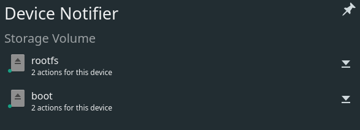

## Setting up SSH

Since this device can be set up without a monitor, we shall. <br />First, we need to enable SSH.
1. Open the boot partition - it should look like so: <br />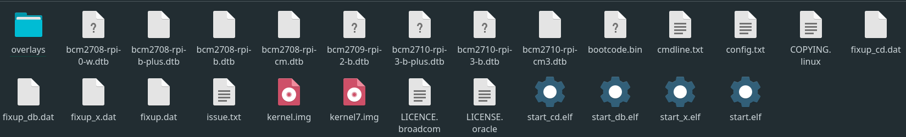

2. Create a `ssh` file. Note that this doesn't have any extension. For Linux users, you can open a console in this directory, and `touch ssh` to create the file. This file enables `ssh` on the latest versions of Raspbian. <br />

3. Edit `config.txt`. Using your preferred editor, add the line `dtoverlay=dwc2` to the end. <br />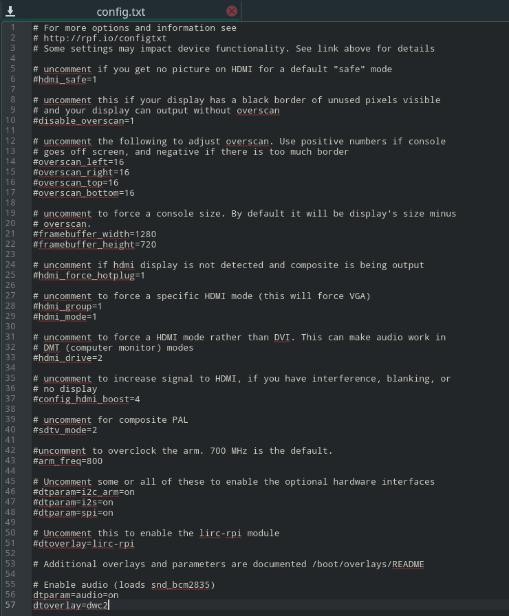

4. Edit `cmdline.txt`. Again, using your preferred editor, between `rootwait` and the next word, insert `modules-load=dwc2,g_ether` leaving only one space after `rootwait` and one before the next word. <br />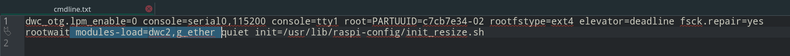

5. Eject the SD card safely. <br />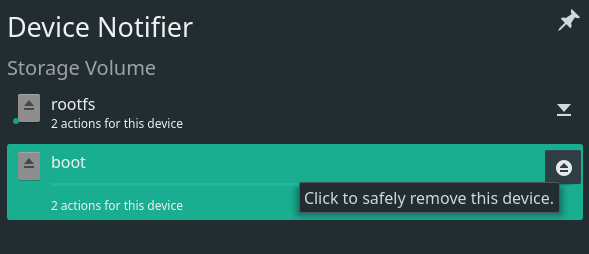

6. Insert the SD card into the Raspberry Pi. <br />

7. Use a known USB micro data cable to connect the Raspberry Pi to a computer.

   * If possible, check this cable can transfer data by connecting another device and attempting to transfer a file.
   * If possible, use a Linux computer for the next step, one with a graphical network manager.
   * If possible, use a USB 3 or higher port instead of a USB 2 port. This is because the USB port will supply the entire power for the Raspberry Pi, and some USB 2 ports may not be able to deliver the required power.

8. Let the Raspberry Pi fully boot up (once the LED stops blinking frequently, it is probably booted). Then you need to configure your network settings.

   * Linux:

     * Use your preferred network manager:

     * Create a new connection profile <br />

     * Set it's type to be 'Wired Ethernet (shared)' if available, else, 'Wired Ethernet'

     * Name it <br />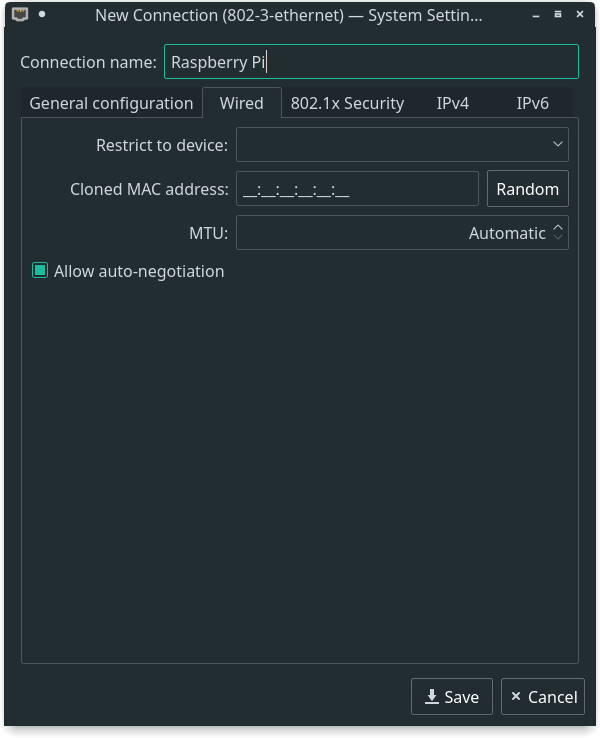

     * Ensure the method is set to 'Shared to other computers', or similar. <br />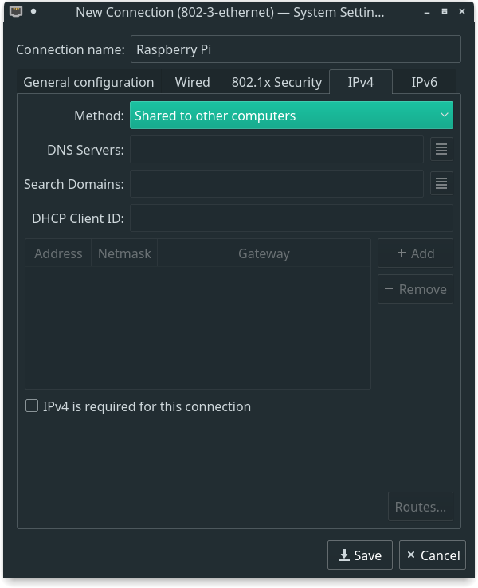

     * Save and connect on the connection not currently used. <br />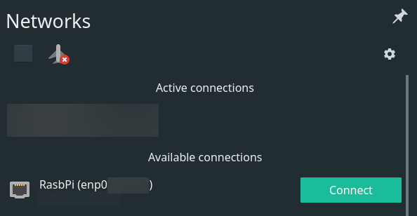

     * Check your IP address on this network. <br />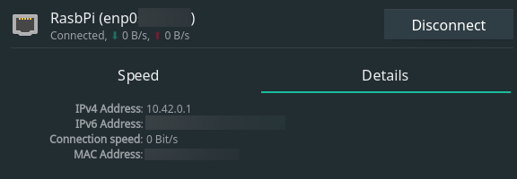

       * This shows that the host computer (Linux) has the IP address `10.42.0.1`

       * Therefore, the Raspberry Pi has an IP address of `10.42.0.*`, where `*` can be any number 2-255.

       * Find the Raspberry Pi's address by using the tool [`nmap`](https://nmap.org/), installable from your preferred package manager.

         `nmap -sn "10.42.0.*"` and look for the IP address which the host doesn't have (i.e. look for the ip address other than 10.42.0.1 in this example).

         For example, when I ran the command, the output was <br />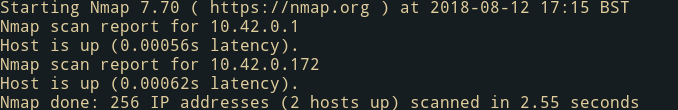

         so the IP address I am looking for is `10.42.0.172`.

9. Connecting

  * Linux users
    * Now finally we can SSH into the Raspberry Pi:

         `ssh pi@RASPBERRY_PI_IP`

         So in my example, the command would be:

         `ssh pi@10.42.0.172`

  * Other OSs

    * For users of windows, see [ssh using PUTTY](https://desertbot.io/blog/headless-pi-zero-ssh-access-over-usb-windows#step-8-install-putty), and for users of OS X, you can simply ssh in using `ssh pi@raspberrypi.local` in a terminal.

  * This should then ask you if you want to continue connecting, displaying the ECDSA key.  Type `yes` and hit enter to continue.<br />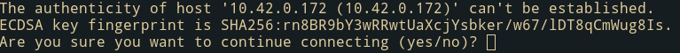

  * Then, when the password is asked for, type `raspberry` - the default password in Raspbian.

10. Then, change your password using `passwd`. Enter `raspberry` as the current password, and a memorable password for the new password.

## Setting up USB config for multiple drivers simultaneously

Past this point, do not reboot / power off unless you wish to start all over again.

1. Edit `/boot/cmdline.txt` by using `sudoedit /boot/cmdline.txt`
   * Remove the `modules-load=dwc2,g_ether` and ensure there is no trailing space.
   * Close and save by pressing `ctrl-x`.
2. Edit `/etc/modules` by using `sudoedit /etc/modules`
   * Add `libcomposite` at the end of the file (i.e. not on a line beggining with `#`).

## Setting up the libcomposite config script

### Getting Git

1. Update package list using `sudo apt-get update`
2. Get git by running `sudo apt-get install git`

### Using this respository

1. Grab the contents of this repository using `git clone https://github.com/Crystalix007/U2FDevice.git`
2. Enter the cloned directory by running `cd U2FDevice`
3. Install the config script using `sudo install -m755 Scripts/Kernel_HID_Config.sh /usr/bin/Kernel_HID_Config.sh`
4. Install the config script startup service by editing `/etc/rc.local`
   * `sudoedit /etc/rc.local`
   * Add `/usr/bin/Kernel_HID_Config.sh`, on a new line, before `'exit 0'`
5. At this point you are once again free to reboot / shutdown.

## Setting up udev rules

For Linux only.

On most distributions of Linux, devices get automatically managed based upon certain tags they expose to the computer. This program exposes custom tags to uniquely identify it from other U2F keys. However, as a result, the automatic rules do not include it in the list of USB devices to mount as U2F keys.

On your Linux desktop, run the command `ls /etc/udev/rules.d/`. Look for anything which seems related to U2F. <br />For example, on my computer, I have the rules `/etc/udev/rules.d/70-u2f.rules`. <br />Inside this file, the contents are:

```
# Copyright (C) 2013-2015 Yubico AB
#
# This program is free software; you can redistribute it and/or modify it
# under the terms of the GNU Lesser General Public License as published by
# the Free Software Foundation; either version 2.1, or (at your option)
# any later version.
#
# This program is distributed in the hope that it will be useful, but
# WITHOUT ANY WARRANTY; without even the implied warranty of
# MERCHANTABILITY or FITNESS FOR A PARTICULAR PURPOSE.  See the GNU Lesser
# General Public License for more details.
#
# You should have received a copy of the GNU Lesser General Public License
# along with this program; if not, see <http://www.gnu.org/licenses/>.

# this udev file should be used with udev 188 and newer
ACTION!="add|change", GOTO="u2f_end"

# Yubico YubiKey
KERNEL=="hidraw*", SUBSYSTEM=="hidraw", ATTRS{idVendor}=="1050", ATTRS{idProduct}=="0113|0114|0115|0116|0120|0200|0402|0403|0406|0407|0410", TAG+="uaccess"

# Happlink (formerly Plug-Up) Security KEY
KERNEL=="hidraw*", SUBSYSTEM=="hidraw", ATTRS{idVendor}=="2581", ATTRS{idProduct}=="f1d0", TAG+="uaccess"

# Neowave Keydo and Keydo AES
KERNEL=="hidraw*", SUBSYSTEM=="hidraw", ATTRS{idVendor}=="1e0d", ATTRS{idProduct}=="f1d0|f1ae", TAG+="uaccess"

# HyperSecu HyperFIDO
KERNEL=="hidraw*", SUBSYSTEM=="hidraw", ATTRS{idVendor}=="096e|2ccf", ATTRS{idProduct}=="0880", TAG+="uaccess"

# Feitian ePass FIDO
KERNEL=="hidraw*", SUBSYSTEM=="hidraw", ATTRS{idVendor}=="096e", ATTRS{idProduct}=="0850|0852|0853|0854|0856|0858|085a|085b", TAG+="uaccess"

# JaCarta U2F
KERNEL=="hidraw*", SUBSYSTEM=="hidraw", ATTRS{idVendor}=="24dc", ATTRS{idProduct}=="0101", TAG+="uaccess"

# U2F Zero
KERNEL=="hidraw*", SUBSYSTEM=="hidraw", ATTRS{idVendor}=="10c4", ATTRS{idProduct}=="8acf", TAG+="uaccess"

# VASCO SeccureClick
KERNEL=="hidraw*", SUBSYSTEM=="hidraw", ATTRS{idVendor}=="1a44", ATTRS{idProduct}=="00bb", TAG+="uaccess"

# Bluink Key
KERNEL=="hidraw*", SUBSYSTEM=="hidraw", ATTRS{idVendor}=="2abe", ATTRS{idProduct}=="1002", TAG+="uaccess"

# Thetis Key
KERNEL=="hidraw*", SUBSYSTEM=="hidraw", ATTRS{idVendor}=="1ea8", ATTRS{idProduct}=="f025", TAG+="uaccess"

# Nitrokey FIDO U2F
KERNEL=="hidraw*", SUBSYSTEM=="hidraw", ATTRS{idVendor}=="20a0", ATTRS{idProduct}=="4287", TAG+="uaccess"

# Google Titan U2F
KERNEL=="hidraw*", SUBSYSTEM=="hidraw", ATTRS{idVendor}=="18d1", ATTRS{idProduct}=="5026", TAG+="uaccess"

LABEL="u2f_end"
```

Basically, this file contains the same contents as [Yubico's udev rules](https://github.com/Yubico/libu2f-host/blob/master/70-u2f.rules). <br />
If you don't have any rules, download the [raw file](https://raw.githubusercontent.com/Yubico/libu2f-host/master/70-u2f.rules), and copy it to the `/etc/udev/rules.d/` directory. <br />
Then, add: <br />
```# Rapsberry Pi U2F```<br /> ```KERNEL=="hidraw*", SUBSYSTEM=="hidraw", ATTRS{idVendor}=="1d6b", ATTRS{idProduct}=="0400", TAG+="uaccess"``` <br />
on lines just before `LABEL="u2f_end"`.

Then, reload the rules using `sudo udevadm control --reload-rules `

## Setting up to build

1. Grab all the submodules using `git submodule update --init --recursive`
2. Copy the `cpp-base64` Makefile using `cp Scripts/cpp-base64-Makefile cpp-base64/Makefile`
3. Copy the `micro-ecc` Makefile using `cp Scripts/uECC-Makefile micro-ecc/Makefile`
4. Make the object file directories using `mkdir obj && mkdir cpp-base64/obj && mkdir micro-ecc/obj`
5. Grab the required library using `sudo apt-get install libmbedtls-dev`

## Build the program

1. Run `make`

## Install the program

1. Run `sudo make install`

# Warnings

## To shut down

This device cannot be powered off without running a command in SSH (for now). If the device has its power interrupted by a sudden poweroff, it is likely there will be corruption which will render all data on the SD card useless.

So, to power off currently, SSH into the device as shown above, then run the command `sudo poweroff ; exit`

## Security issues

This project is intended solely for the use in experimentation of the use of U2F or as a backup for keys. It is _not_ intended for use as a regular day-to-day key for several reasons.

* Private keys are stored in a freely accessible file (to users of the pi) `/usr/share/U2FDevice/U2F_Priv_Keys.txt`
* This program doesn't comply with the specification with regards to user interaction. There is a specific code sent to check for user interaction for registering or authenticating keys. This requirement is ignored by this implementation as there are no pre-existing buttons on the Pi.
* Whilst this program is functional, it has the possibility of unintended crashes. I have tested to the limits I require, but you may require additional assurance.
* This program's private keys are stored on an SD card. This is an incredibly volatile medium (and yes, regularly I mean that in the computing sense - SD cards regularly do cleanup / maintenance routines that can cause complete corruption if the power is lost suddenly). I would not consider these keys safe under very regular use (infrequent use should be fine though).
* This solution is rather unwieldy - it requires a long boot time and must be shutdown (for now) with a command using SSH.

For these reasons, if you want to use this as a way to backup your other U2F devices against loss, this may be a very valid solution, but please don't rely solely on this solution for U2F security.

## To improve RNG (improve crypto security)

1. Install `rng-tools` with `sudo apt-get install rng-tools`

## To change the Attestation certificate

This may be highly advisable, or inadvisable - I am currently unsure. <br />All registration requests use this private key, so likely advisable. <br/>However, you can be uniquely identified by having a unique attestation certificate.

See the `Readme.AttestationCertificateGeneration.txt`

# Running the program

## To run

Run `sudo systemctl start U2FDevice.service`

At this point, the program should be tested using U2F demo websites. For example, [Yubico's U2F demo](https://demo.yubico.com/u2f?tab=register), or (appspot's U2F demo)[https://crxjs-dot-u2fdemo.appspot.com/]. First register the device, then test authentication.

If the program doesn't work on these - don't use as a backup device.

## To run automatically at boot

Once the program runs successfully, you can enable automatic startup at boot.

Run `sudo systmectl enable U2FDevice.service`

## Debug files

For those of you wishing to dig around in the actual protocol work, these are the files used by the application to log the activity.

The documents used for raw communication contain just that - the raw data sent to and from the device. <br />To view this data, I would recommend using `od` . For example, `cat /tmp/comdev.txt | od -tx1 -Anone -v` in order  to print out the bytes sent from the Raspberry Pi to the PC in hexadecimal form.

The documents used for packets show the higher-level structures used in the U2F protocol. The first level above the data sent in USB frames is the `U2F-HID` protocol. The most recent specification for these packets is available [here](https://fidoalliance.org/specs/fido-u2f-v1.2-ps-20170411/fido-u2f-hid-protocol-v1.2-ps-20170411.html) (as of 12/07/2018). This level details mainly how the PC performs the setup for talking to the device.

The next level above that is the actual `U2F` protocol. The most recent specification for these messages is available [here](https://fidoalliance.org/specs/fido-u2f-v1.2-ps-20170411/fido-u2f-raw-message-formats-v1.2-ps-20170411.html) (as of 12/07/2018). This level details how registration and authentication actually occurs.

* __Raw communication__
  * /tmp/comdev.txt
  * /tmp/comhost.txt

* __Packets__
  * /tmp/devPackets.html
  * /tmp/devAPDU.html
  * /tmp/hostPackets.html
  * /tmp/hostAPDU.html